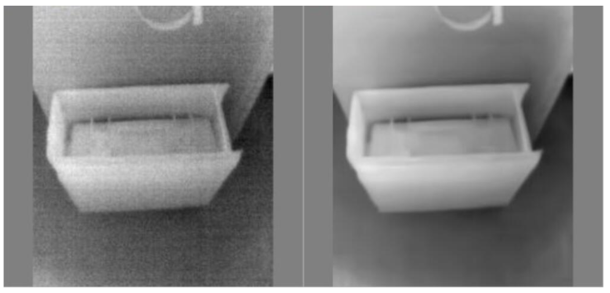
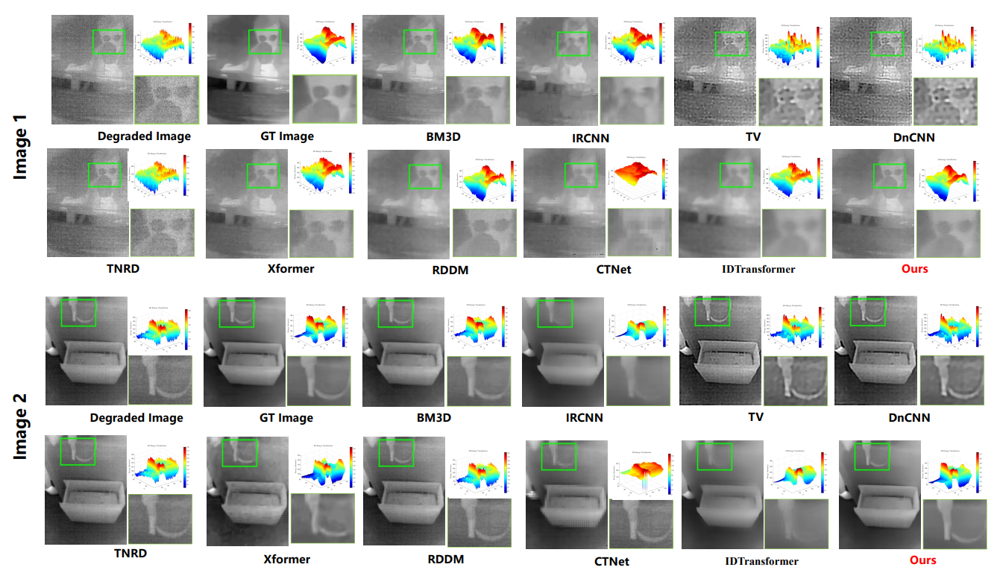
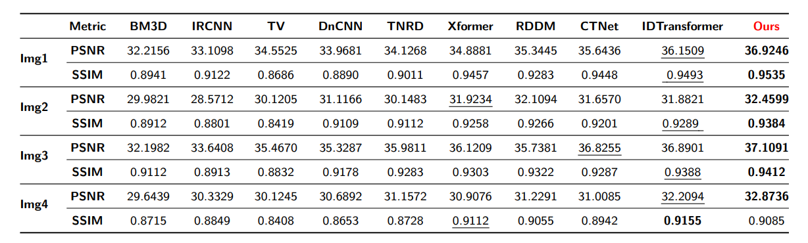

# Update 
2025.05.17   

We have submitted our manuscript to the Measurement Journal, wish us good luck. We will release our code immediately upon acceptance


# Infrared_Denoise

We propose a denoising model for infrared images designed for hybird noise.


We will publicly open all code and resources after the paper is accepted. Thank you for your attention.  


---
**Dataset** 
We have used both real datasets and simulated datasets for experiments. The real dataset is used to verify the denoising performance of real situations. The purpose of the simulated dataset is to explore the potential performance of our method.


We use the image from the link below for denoising.

http://openai.raytrontek.com/apply/E_Image_noise_reduction.html/

It provides RAW format images, and I provide batch processing code to convert them into readable and writable formats, such as png, bmp, etc.

<center>

</center


---


**Results** 

*Visualize the results*
Real dataset:

<center>

</center>


*Quantitative Evaluation*
<center>

</center>


---


```
@inproceedings{llvip,
  title={LLVIP: A visible-infrared paired dataset for low-light vision},
  author={Jia, Xinyu and Zhu, Chuang and Li, Minzhen and Tang, Wenqi and Zhou, Wenli},
  booktitle={Proceedings of the IEEE/CVF international conference on computer vision},
  pages={3496--3504},
  year={2021}
}

```


**Contact**   
If you encounter any problems during use, please do not hesitate to email me.     
Email:imagevisioner@outlook.com    or lh_010625@163.com

---


**Acknowledgments**   

Our work has benefited from the National Natural Science Foundation of China. And the work on the following two datasets. Please cite when it is helpful to you.


``` 
@article{liu2025multi,
  title={Multi-stage non-uniformity correction pipeline for single-frame infrared images based on hybrid high-order directional and low-rank prior information},
  author={Liu, Chenhua and Li, Hao and Li, Maoyong and Deng, Lei and Dong, Mingli and Zhu, Lianqing},
  journal={IEEE Sensors Journal},
  year={2025},
  publisher={IEEE}
}
```
``` 
@inproceedings{llvip,
  title={LLVIP: A visible-infrared paired dataset for low-light vision},
  author={Jia, Xinyu and Zhu, Chuang and Li, Minzhen and Tang, Wenqi and Zhou, Wenli},
  booktitle={Proceedings of the IEEE/CVF international conference on computer vision},
  pages={3496--3504},
  year={2021}
}
``` 
